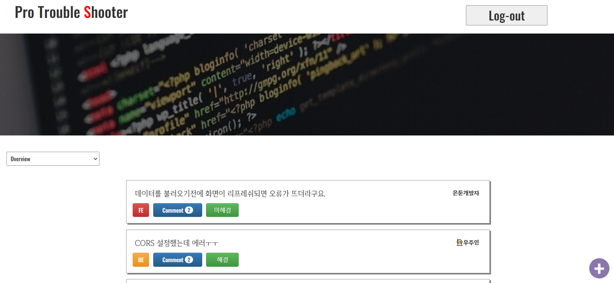
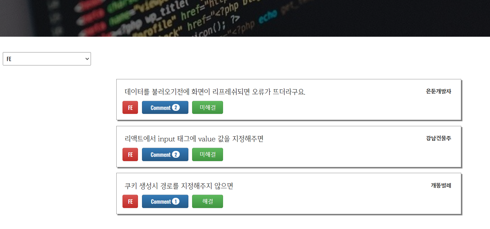
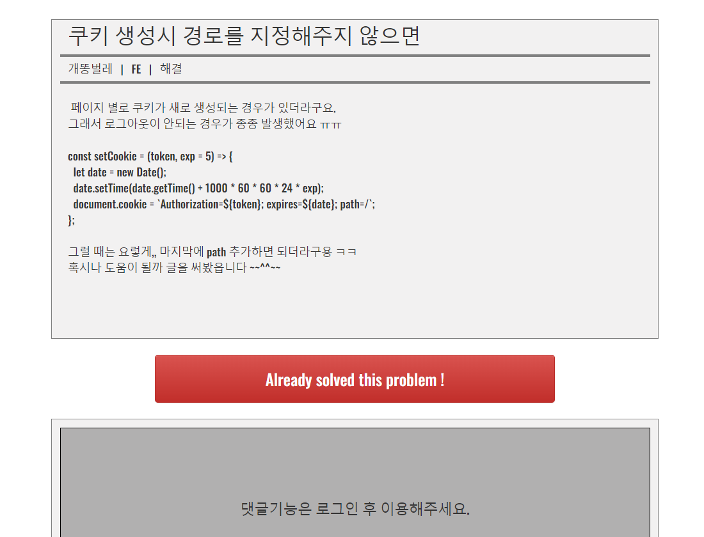
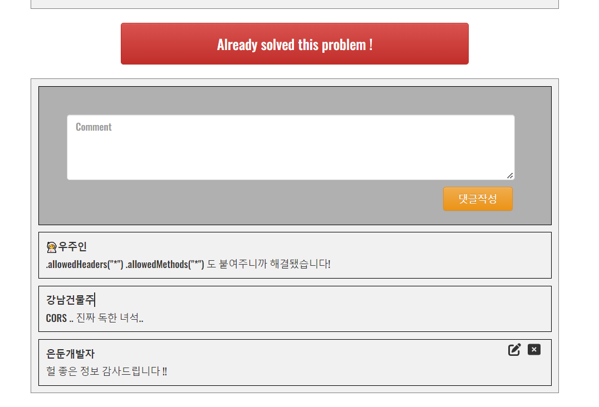

# pro-trouble-shooter

개발 중에 경험한 에러가 있으신가요?<br/>
`pro-trouble-shooter`에 기록하고 정보를 공유하세요!

## 주요 기능

`1. 기본 메인 홈페이지 UI`

---



---

`2. 카테고리별 게시글 목록 정렬`

---



---

`3. 문제 해결 여부 체크 버튼 추가`, `로그인한 사용자에 한해 댓글 기능 오픈`

---



---

`4. 본인 게시글 및 댓글 수정/삭제 기능 추가`

---



## Specs

- `FE` React
- `BE` Spring

## 개발기간 및 팀원 소개

### 2022.07.22 ~ 2022.07.28

- FrontEnd - 전인호, 김다흰
- BackEnd - 홍우석, 김현, 박주영

## Installation (React)

```
$ yarn create react-app pro_trouble_shooting
$ yarn add redux react-redux
$ yarn add react-router-dom@5.3.0
$ yarn add redux-thunk
$ yarn add react-cookie
$ yarn add jwt-decode

$ yarn add styled-components
$ yarn add @fortawesome/fontawesome-svg-core
$ yarn add @fortawesome/free-solid-svg-icons
$ yarn add @fortawesome/react-fontawesome

$ yarn init -y
$ yarn add json-server
$ yarn json-server --watch db.json --port 5001

$ yarn add axios
```
